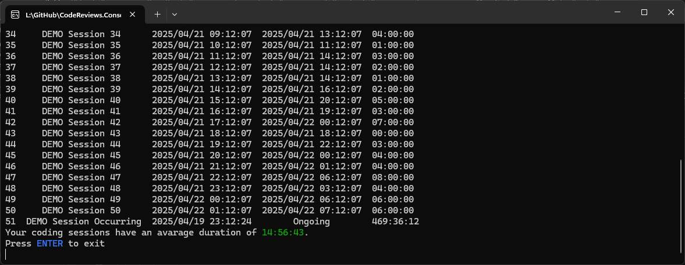

# Console Coding Tracker
Console based CRUD application to track time spent coding daily.

Unfortunately I haven't really finished all the challanges on this one yet and I wanna move onto the other projects, but I will try to finish it in the future. 

# Project Requirements
## Mandatoy:
- [x] This application has the same requirements as the previous project, except that now you'll be logging your daily coding time.
- [x] To show the data on the console, you should use the "Spectre.Console" library.
- [x] You're required to have separate classes in different files (ex. UserInput.cs, Validation.cs, CodingController.cs)
- [x] You should tell the user the specific format you want the date and time to be logged and not allow any other format.
- [x] You'll need to create a configuration file that you'll contain your database path and connection strings.
- [x] You'll need to create a "CodingSession" class in a separate file. It will contain the properties of your coding session: Id, StartTime, EndTime, Duration
- [x] The user shouldn't input the duration of the session. It should be calculated based on the Start and End times, in a separate "CalculateDuration" method.
- [x] The user should be able to input the start and end times manually.
- [x] You need to use Dapper ORM for the data access instead of ADO.NET. (This requirement was included in Feb/2024)
- [x] When reading from the database, you can't use an anonymous object, you have to read your table into a List of Coding Sessions.
- [x] Follow the DRY Principle, and avoid code repetition.

## Optional:
- [x] Add the possibility of tracking the coding time via a stopwatch so the user can track the session as it happens.
- [ ] Let the users filter their coding records per period (weeks, days, years) and/or order ascending or descending.
- [ ] Create reports where the users can see their total and average coding session per period.
- [ ] Create the ability to set coding goals and show how far the users are from reaching their goal, along with how many hours a day they would have to code to reach their goal. You can do it via SQL queries or with C#.

## Others:
- Menu that enables the user to modify settings

# Resources
- [The C# academy project page](https://thecsharpacademy.com/project/13/coding-tracker)
- [SQLite documentation](https://www.sqlite.org/)
- [MS docs for setting up SQLite with C#](https://www.learndapper.com/)
- [Spectre Console Docs](https://spectreconsole.net/)
- [Newtonsoft.Json for configuration files](https://www.newtonsoft.com/json)

# Screenshots

